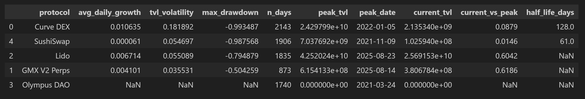

# Curve DEX — TVL Quality & Sustainability Assessment

## Snapshot
- Average daily TVL growth: **1.06%**
- TVL volatility: **0.18**
- Maximum drawdown: **−99.3%**
- Peak TVL: **$24.3B** (Jan 2022)
- Current TVL: **$2.14B**
- Current vs peak: **8.8%**
- Estimated TVL half-life: **~128 days**
- Observation window: **2143 days**

## Interpretation
Curve experienced strong growth during peak DeFi liquidity cycles, driven primarily
by stablecoin yield incentives and composability with lending protocols.
However, the extreme drawdown from peak levels highlights a TVL base that is
highly reflexive and sensitive to yield compression.

The relatively high volatility and near-total drawdown suggest that capital
allocation to Curve has historically been opportunistic rather than structural.

## Sustainability Takeaway
Curve’s TVL profile reflects **cyclical liquidity concentration**, not long-term
capital stickiness. Sustainability is tightly coupled to external demand for
stablecoin liquidity and incentive design rather than endogenous protocol revenue.
